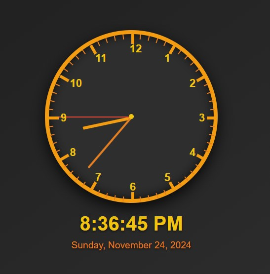

# Advanced Analog and Digital Clock

An interactive **analog and digital clock** that dynamically displays the current time and date with a sleek, modern design. Perfect for learning or showcasing DOM manipulation, CSS animations, and JavaScript functionality.

## Features

- **Analog Clock**: Displays current time with hour, minute, and second hands, dynamically updated every second.
- **Digital Clock**: Shows the current time in a 12-hour format with AM/PM, along with the full date.
- **Dynamic Elements**: Clock markings and hour numbers are generated using JavaScript.
- **Responsive Design**: Looks great on various screen sizes with smooth animations.

## Installation

1. Clone the repository:
   ```bash
   git clone https://github.com/Abdulrauf1122/analog_and_digital_clock.git
   ```
2. Navigate to the project directory:
   ```bash
   cd analog_and_digital_clock
   ```
3. Open `index.html` in your browser to view the clock.

## Files

- `index.html`: Contains the structure of the clock.
- `style.css`: Provides the styling for the clock's appearance.
- `script.js`: Implements real-time functionality and dynamic updates.

## Technologies Used

- **HTML5**: For structuring the clock.
- **CSS3**: For styling and animations.
- **JavaScript**: For functionality and real-time updates.

## Screenshot



## Future Enhancements

- Add a toggle for 12-hour and 24-hour time formats.
- Include customizable themes (light and dark mode).
- Support multiple languages for date and time.

## License

This project is licensed under the [MIT License](LICENSE).
